# 开发环境

1. 为npm配置淘宝镜像

``` Auto
npm install -g cnpm --registry=https://registry.npm.taobao.org
```

2. 查看npm配置信息

```

```
3. 通过淘宝镜像全局安装Electron

```
cnpm install electron -g
```

4. Electron
* 关于[Electron](https://electronjs.org)
* 关于[Electron.NET](https://github.com/ElectronNET/Electron.NET)

* 创建 .Net Core MVC项目- HM.ControlCenter

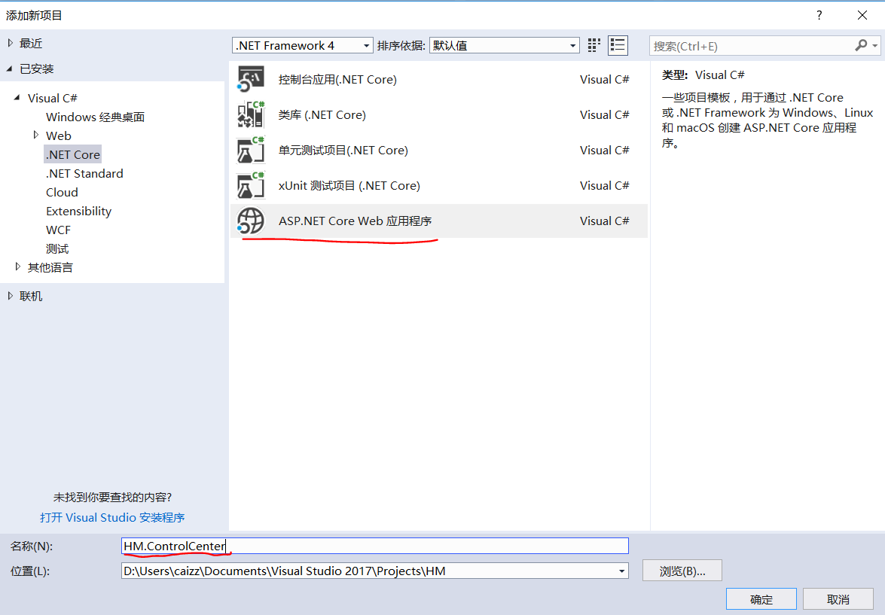

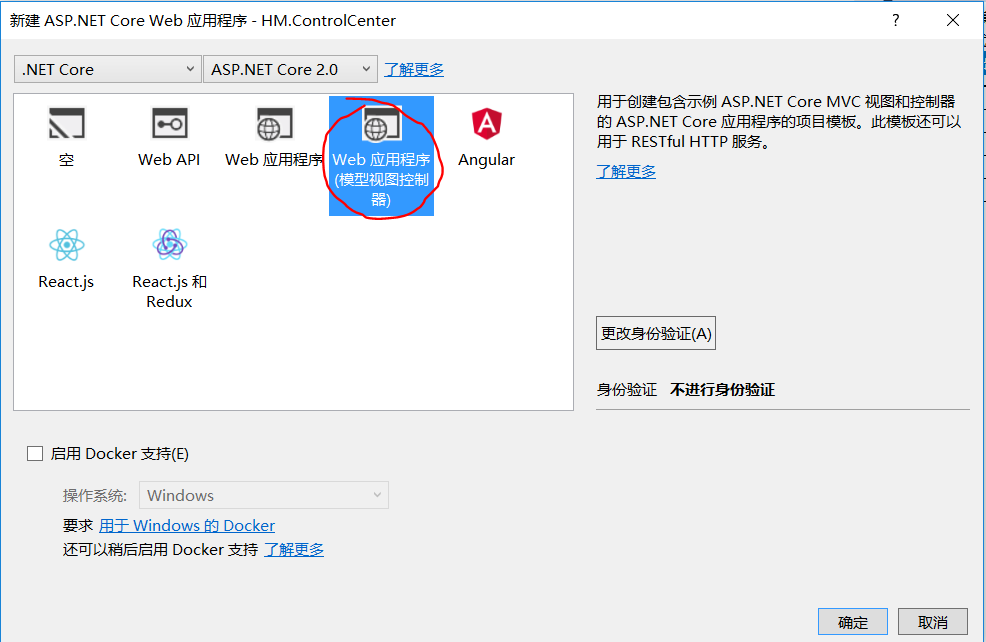

* 添加ElectronNET_API Nuget包

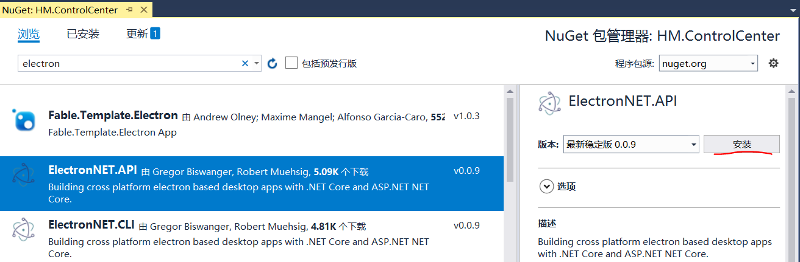

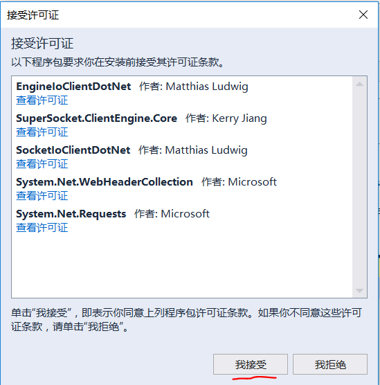

* 修改项目文件Program.cs
添加命名空间
``` C#
using ElectronNET.API;
```
``` C#
public static IWebHost BuildWebHost(string[] args)
{
    return WebHost.CreateDefaultBuilder(args)
        .UseElectron(args)
        .UseStartup<Startup>()
        .Build();
}
```

* 修改项目文件Startup.cs
``` C#
using ElectronNET.API;
```
``` C#
public void Configure(IApplicationBuilder app, IHostingEnvironment env)
{
    if (env.IsDevelopment())
    {
        app.UseDeveloperExceptionPage();
        app.UseBrowserLink();
    }
    else
    {
        app.UseExceptionHandler("/Home/Error");
    }

    app.UseStaticFiles();

    app.UseMvc(routes =>
    {
        routes.MapRoute(
            name: "default",
            template: "{controller=Home}/{action=Index}/{id?}");
    });

    // Open the Electron-Window here
    Task.Run(async () => await Electron.WindowManager.CreateWindowAsync());
}
```

* 安装ElectronNET.Cli —— 通过NuGet包管理工具安装

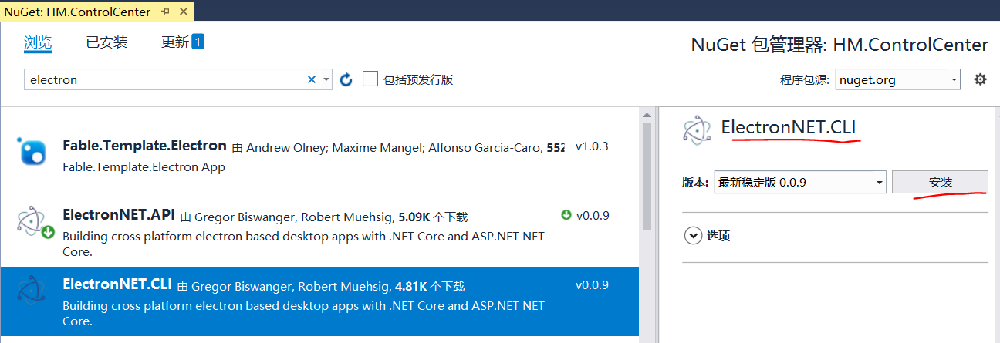

* 安装ElectronNET.Cli —— 通过NuGet包管理工具安装失败

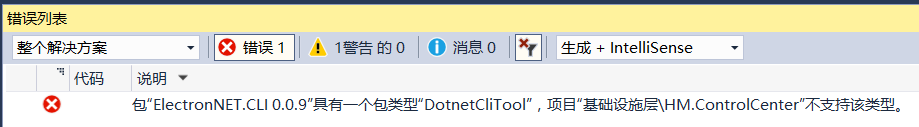

* 通过其他渠道安装：

打开HM.ControlCenter.csproj文件，添加如下内容

```
 <ItemGroup>
    <DotNetCliToolReference Include="ElectronNET.CLI" Version="0.0.9" />
  </ItemGroup>
```
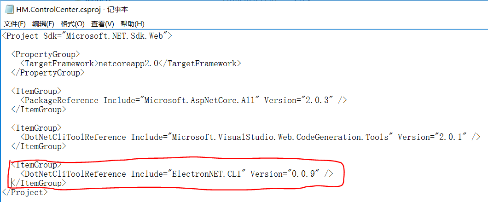

* 调试站点


* 调试Electron初始化

打开cmd，cd至Electron.Net项目目录，执行

```
dotnet restore
```
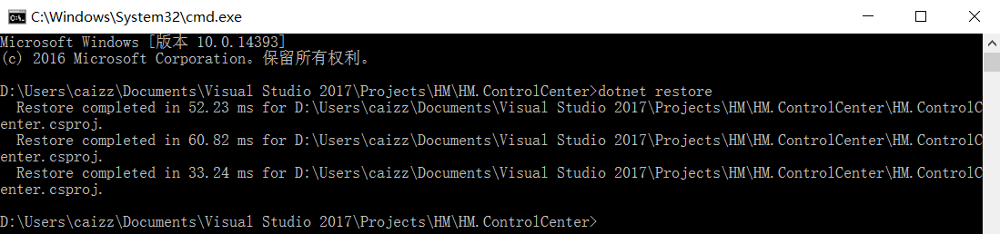
```
dotnet electronize init
```
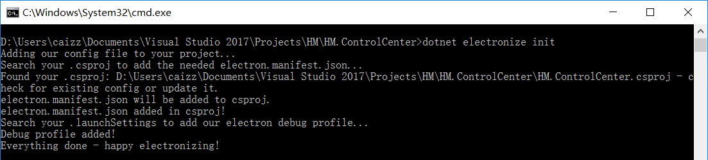

此时，项目发生的变化如下
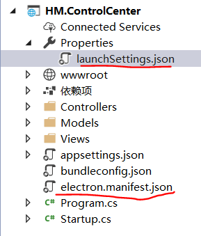

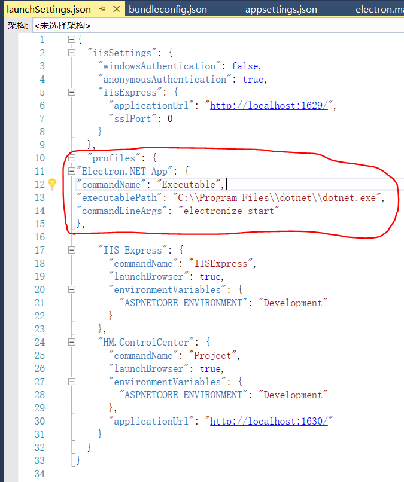

* 通过指令或者通过VS启动项目，本质上都是通过dotnet执行electronize start

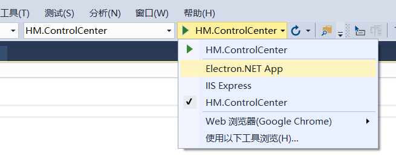

或者是

```
dotnet electronize start
```

等得花都谢了
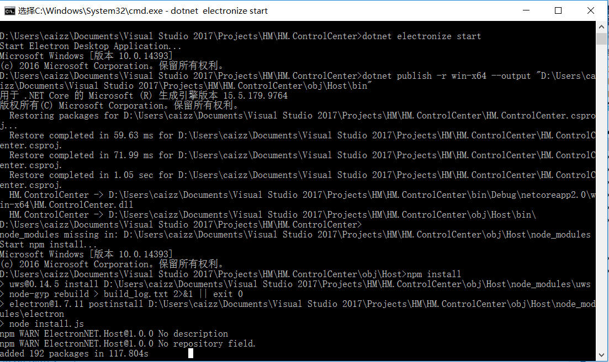

